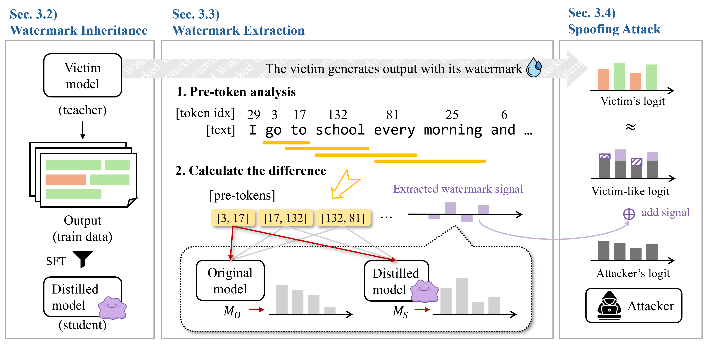

# DITTO: A Spoofing Attack Framework on Watermarked LLMs via Knowledge Distillation

This repository contains the official code for the paper **"DITTO: A Spoofing Attack Framework on Watermarked LLMs via Knowledge Distillation"**. DITTO demonstrates a critical vulnerability in current Large Language Model (LLM) watermarking schemes by enabling a malicious model to generate text that appears to be watermarked by a different, trusted model.



## 📜 Abstract
The security of LLM watermarking relies on the assumption that a specific watermark proves authorship by a specific model. Our work, DITTO, demonstrates that this assumption is critically flawed. We introduce a spoofing attack that allows an attacker's model to generate text containing the authentic-looking watermark of a victim model. This is achieved by repurposing watermark radioactivity—the tendency for models to inherit data patterns during fine-tuning—as an attack vector through knowledge distillation. DITTO reveals a significant security gap in authorship verification and highlights the need for more robust technologies that can distinguish authentic watermarks from forged ones.

## ⚙️ Methodology Overview
The DITTO framework operates in three main stages to successfully imitate and deploy a victim's watermark.

1. **Watermark Inheritance**: A student model is fine-tuned on text generated by the watermarked "teacher" (victim) model. Through this supervised fine-tuning (SFT) process, the student model inherits the statistical patterns of the teacher's watermark due to watermark radioactivity.

2. **Watermark Extraction**: We isolate the watermark's signal by comparing the output logits of the fine-tuned student model ($M_S$) against the original, pre-trained student model ($M_O$). The difference reveals the systematic bias introduced by the watermark, which we call the Extracted Watermark Signal (EWS).


3. **Spoofing Attack**: During inference, the extracted EWS is added directly to the logits of the attacker's model. This injects the victim's statistical fingerprint, causing the attacker's model to generate text that a detector will falsely attribute to the victim model.


## 🔧 Setup and Installation
1. Clone the repository.

2. Set up the Python environment.
    ```bash
    conda create -n ditto python=3.12
    conda activate ditto
    ``` 

3. Install dependencies.
    ```bash
    pip install -r requirements.txt
    ```

## 📈 Experimental Pipeline 

1. **Generate Watermarked Training Data (from Teacher)** \
First, use the watermarked teacher model (e.g., Llama-3.1-8B-Instruct) to generate a dataset. This data will be used to train the student model.
    ```bash
    # train data for MMW Bookreport
    python generate_training_data.py \
        --model_path meta-llama/Llama-3.1-8B-Instruct \
        --total_samples 10000 \
        --num_workers 4 \
        --output_dir watermarked_data/kgw/llama3.1-8b \
        --batch_size 2 \
        --final_output syntheticQA_for_mmw.json \
        --watermark kgw \
        --config_file config/KGW.json

    # train data for others (e.g., Dolly CW)
    python generate_watermarked_data.py --data_path datasets/dolly_cw.jsonl \
        --model_path meta-llama/Llama-3.1-8B-Instruct \
        --data_mode dolly_cw \
        --max_samples 10000 \
        --batch_size 2 \
        --num_processes 4 \
        --max_new_tokens 512 \
        --output_file watermarked_data/synthid/llama3.1-8b/watermarked_dolly_cw.json \
        --shuffle 1 \
        --watermark 1 \
        --watermark_type synthid \
        --config_file config/SynthID.json

    # Split train/test sets
    python watermarked_data/train_test_split.py
    ```

2. **Preprocess the Data** \
Filter the generated data to remove low-quality samples and duplicates, and convert it to the required format for training.
    ```bash
    python utils/filter.py \
        --input_file watermarked_data/kgw/llama3.1-8b/syntheticQA_for_mmw.json \
        --filtered_file watermarked_data/kgw/llama3.1-8b/syntheticQA_for_mmw_filtered.json \
        --output_file watermarked_data/kgw/llama3.1-8b/syntheticQA_for_mmw_final.json
    ```

3. **Fine-Tune the Student Model (Watermark Inheritance)** \
Use LLaMA-Factory to fine-tune a student model (e.g., Llama-3.2-3B-Instruct) on the watermarked dataset created in the previous steps.
    ```bash
    # Move training data to LLaMA Factory's data directory
    mkdir -p LLaMA-Factory/data/from_llama3.1-8b/
    cp watermarked_data/kgw/llama3.1-8b/syntheticQA_for_mmw_final.json LLaMA-Factory/data/from_llama3.1-8b/

    # Run the training
    cd LLaMA-Factory
    llamafactory-cli train examples/train_full/ditto_sft.yaml
    ```

4. **Extract the Watermark Signal (EWS)** \
This multi-step process isolates the watermark's statistical signal. \
    ```bash
    # Prefix analysis
    python utils/analyze_prefix_frequency.py \
        --tokenizer_path meta-llama/Llama-3.2-3B-Instruct \
        --input_file training_data/from_llama3.1-8b_dolly_cw_train.jsonl \
        --output_file data_analysis/llama3.1-8b/training_data_prefix_freq/dolly_cw/prefix_1.json \
        --prefix_length 1

    # Calculate local bias
    python watermark_stealing/calculate_local.py \
        --freq_file data_analysis/llama3.2-3b/training_data_prefix_freq/dolly_cw/prefix_1.json \
        --model_before_training meta-llama/Llama-3.2-3B-Instruct \
        --model_after_training LLaMA-Factory/trained_students/llama3.2-1b/kgw_dolly_cw \
        --output_file data_analysis/llama3.2-3b/local/dolly_cw/n_1.json \
        --freq_threshold 5e-5 \
        --data_file training_data/from_llama3.2-3b_dolly_cw_train.jsonl \
        --num_workers 4 \
        --num_workers_logits 2

    # Calculate global bias
    python watermark_stealing/calculate_global.py \
        --model_before_training meta-llama/Llama-3.2-3B-Instruct \
        --model_after_training LLaMA-Factory/trained_students/llama3.2-1b/kgw_dolly_cw \
        --output_file data_analysis/llama3.2-3b/local/dolly_cw/n_0.json \
        --data_file training_data/from_llama3.2-3b_dolly_cw_train.jsonl \
        --num_workers_logits 2
    
    # Calculate weights
    python watermark_stealing/calculate_w.py \
        --freq_file data_analysis/llama3.2-3b/training_data_prefix_freq/dolly_cw/prefix_1.json \
        --freq_threshold 5e-5 \
        --output_file data_analysis/llama3.2-3b/prefix_weight/dolly_cw/w_1.json
    ```

5. **Perform the Spoofing Attack** \
Use the extracted signal (referenced in the config file) to generate text with a spoofed watermark.
    ```bash
    python do_spoofing.py \
        --data_path datasets/dolly_cw_test.jsonl \
        --teacher_model_path meta-llama/Llama-3.2-3B-Instruct \
        --data_mode dolly_cw \
        --reverse_watermark_config config/ReverseWatermark_1.json \
        --output_file spoofing_output/llama3.1-8b/dolly_cw/spoofed_output.jsonl \
        --max_samples 100 \
        --batch_size 2 \
        --num_processes 4
    ```

6. **Evaluate the Attack's Success** \
Run a watermark detector on the spoofed output to measure the True Positive Rate (TPR), p-value, and perplexity.
    ```bash
    python detect.py \
        --input spoofing_output/llama3.1-8b/dolly_cw/spoofed_output.jsonl \
        --output_dir ./exp_results/spoofing/dolly_cw/mimic_llama3.1-8b \
        --wm_model_path meta-llama/Llama-3.2-3B-Instruct \
        --ppl_model_path meta-llama/Llama-2-7b-chat-hf \
        --dataset dolly_cw \
        --watermark kgw \
        --config_file config/KGW.json
    ```


## ⚠️ Ethical Considerations
The DITTO framework is released for research purposes only. Our goal is to proactively identify and expose a critical vulnerability in LLM watermarking to encourage the development of more robust security measures. This work is intended as a red-teaming exercise for the AI safety community. We strongly condemn the use of this technology for malicious activities, such as spreading disinformation or falsely attributing harmful content. Responsible disclosure is essential for building a more secure and trustworthy AI ecosystem.